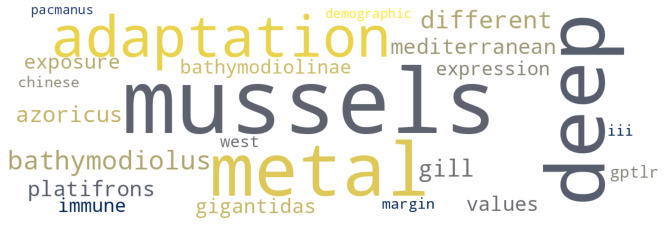
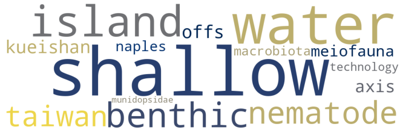

# pubmed2worldmap
## Plot num of PubMed search results on a world map
#
# Features
- Asynchronous scraper for PubMed website (`scraperutils.py`, `asyncio`, `BeautifulSoup`)
- Automatically switch to scrape year-by-year if PubMed limit of 10_000 exceeded
  (warns to narrow search terms if year-by-year also exceeds 10_000 records limit)
- City, country, and US states names from affiliations (`geoutils.py`, `geopy`, `geonamescache`)
- Plot world map by country/US state (`geoutils.py`, `geopandas`)
- Keywords extraction (`wordutils.py`, `wordfreq`, `wordcloud`, `difflib`, `nltk`)

# Scrape PubMed
```
import sys
sys.path.append("pubmed2worlmap/")
from scraperutils import PubMedScraper
import nest_asyncio; nest_asyncio.apply() # need this to run asyncio in jupyter notebooks


# Let us download search results for "hydrothermal vents" to folder "pubmed"
search_terms = "hydrothermal vents"
s = PubMedScraper(search_terms, folder="pubmed", download=True)

# Get pandas DataFrame with year, pmid, and title of all search results 
s.data.head()
```

# Plot world map with number of search results by country (and US state)
```
from parserutils import parse_geo_data
from geoutils import plot_worldmap

# Parse city, country, and US states names from author affiliations
data = parse_geo_data(s)

# Show data on world map
# (geopandas does not provide US states map, so you need to download a ".shp" file manually
# e.g. from https://hub.arcgis.com/datasets/CMHS::states-shapefile/about)
plot_worldmap(data, us_shapefile="./geodata/States_shapefile.shp",
              caption=f'Num publications on "{search_terms}" in PubMed')
```


# Extract keywords and cluster search rusults by topics (experimental)
```
from parserutils import cluster_topics, topic_wordcloud

cluster_topics(s)

# Show word clouds of keywords for top-3 topics
for topic in range(3):
    topic_wordcloud(s, topic)
```

Topic #0 keywords cloud


Topic #1 keywords cloud


Topic #2 keywords cloud


